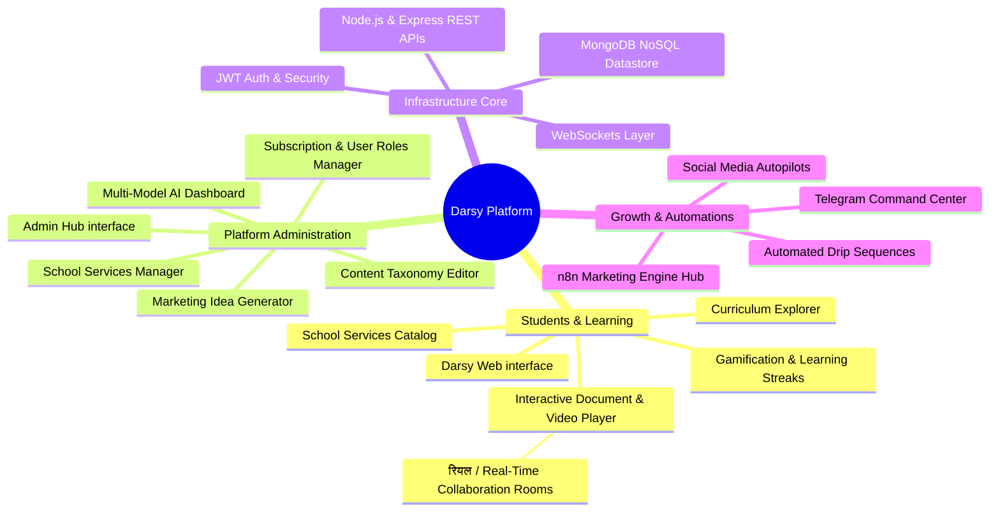
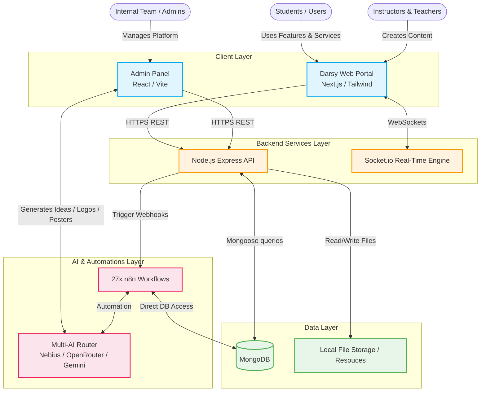
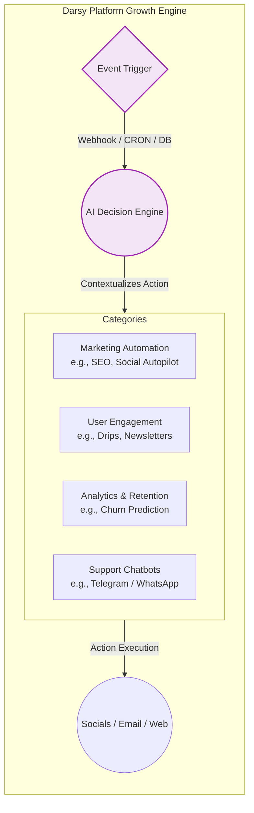

# Darsy Platform Visualizations

Here is a visual representation of Darsy that you can use to explain the project architecture, features, and system interactions to your partner. 

## 1. High-Level Concept Map

This mind map breaks down the platform from a top-level business view down to the core functionalities offered by each module.

---

## 2. Technical System Architecture

This flow chart outlines how the moving parts communicate with one another under the hood.

---

## 3. The 27-Workflow N8N Marketing Engine

Since automations define how the web-app scales with zero human-effort, here is a breakdown of how the marketing layer independently fuels Darsy.

