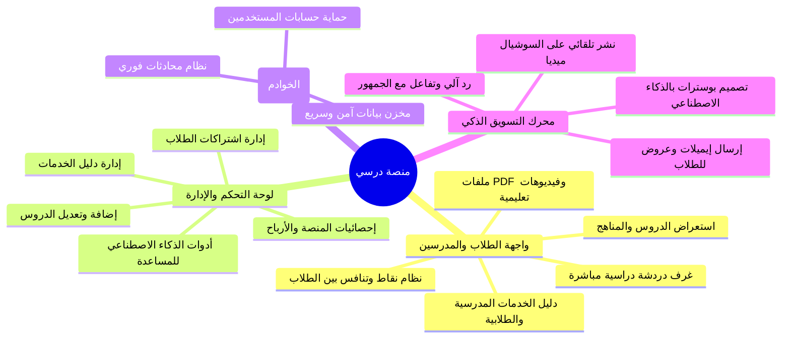
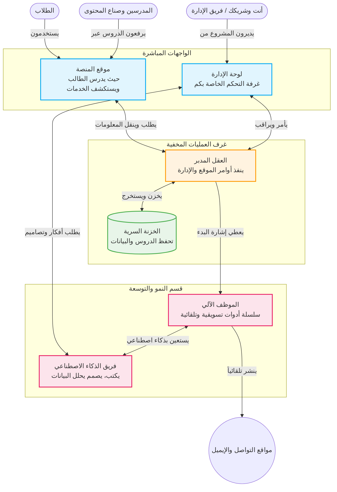

# نظرة عامة على منصة "درسي" (بشكل مبسط)

هذا الملف مصمم خصيصاً لشرح فكرة وهيكلة منصة **"درسي"** لشخص لا يمتلك أي خلفية برمجية أو تسويقية. يمكنك استخدامه كأداة بصرية ممتازة في عرض المشروع لشريكك.

---

## 1. الخريطة الذهنية للمشروع (ماذا تقدم المنصة؟)

توضح هذه الخريطة الأقسام الأربعة الرئيسية التي تقوم عليها منصة درسي بشكل مبسط.



---

## 2. كيف تعمل الأجزاء مع بعضها؟ (دورة العمل)

هذا الرسم يوضح كيف يتفاعل المستخدمون مع المنصة، وكيف يقوم "العقل المدبر" للمنصة بتنظيم العمليات بدون تدخل بشري.



---

## 3. آلة التسويق التي تعمل من تلقاء نفسها

بدلاً من تعيين فريق تسويق كامل، منصة "درسي" تمتلك نظاماً آلياً يتخذ القرارات، يكتب المحتوى، وينشره يومياً لزيادة عدد الطلاب المشتركين. هذا الرسم يوضح كيف تعمل 27 آلية تسويقية في الخلفية لخدمتكم.

```mermaid
graph LR
  subgraph موظف المبيعات الآلي (يعمل 24/7)
    direction TB
    
    Trigger{حدث معين<br/>مثل: طالب جديد سجل}
    Think((القرار الآلي))

    subgraph أقسام التسويق
      Mark[جذب الزبائن<br/>تصاميم ومنشورات تلقائية للشبكات]
      Engage[العناية بالعميل<br/>إيميلات ترحيب ورسائل مبيعات]
      Ana[الحفاظ على الطلاب<br/>استشعار الطلاب المعرضين للإلغاء والتواصل معهم]
      Interact[خدمة العملاء<br/>رد ذكي على تيليجرام وواتساب]
    end
    
    Trigger -->|ينبه| Think
    Think -->|يفوض المهمة لـ| أقسام التسويق
  end

  classDef main fill:#f3e5f5,stroke:#9c27b0,stroke-width:2px;
  class Think,Trigger main;
```

## ملخص العرض لشريكك:
1. **المشروع جاهز ومكتمل الدورة:** يبدأ بموقع قوي للطلاب لاستعراض دروسهم وطلب الخدمات والدردشة مع زملائهم المدرسين.
2. **إدارة سلسة جداً:** لوحة تحكم واحدة تعطيك السلطة الكاملة لرؤية الأرباح والمحتوى والتحكم في دليل الخدمات المدرسي.
3. **توفير رواتب وأدوات:** المنصة تمتلك ذكائها الاصطناعي الخاص الذي يكتب المقالات التسويقية ويولد تصاميم السوشيال ميديا وشعارات الحملات دون الحاجة لاشتراكات خارجية لكل عضو في الفريق.
4. **تسويق يعمل وأنت نائم:** آلات أوتوماتيكية تتواصل مع الطلاب الجدد، تنشر على حسابات المنصة، وتعيد إحياء المشتركين القدامى بشكل تلقائي تام.
